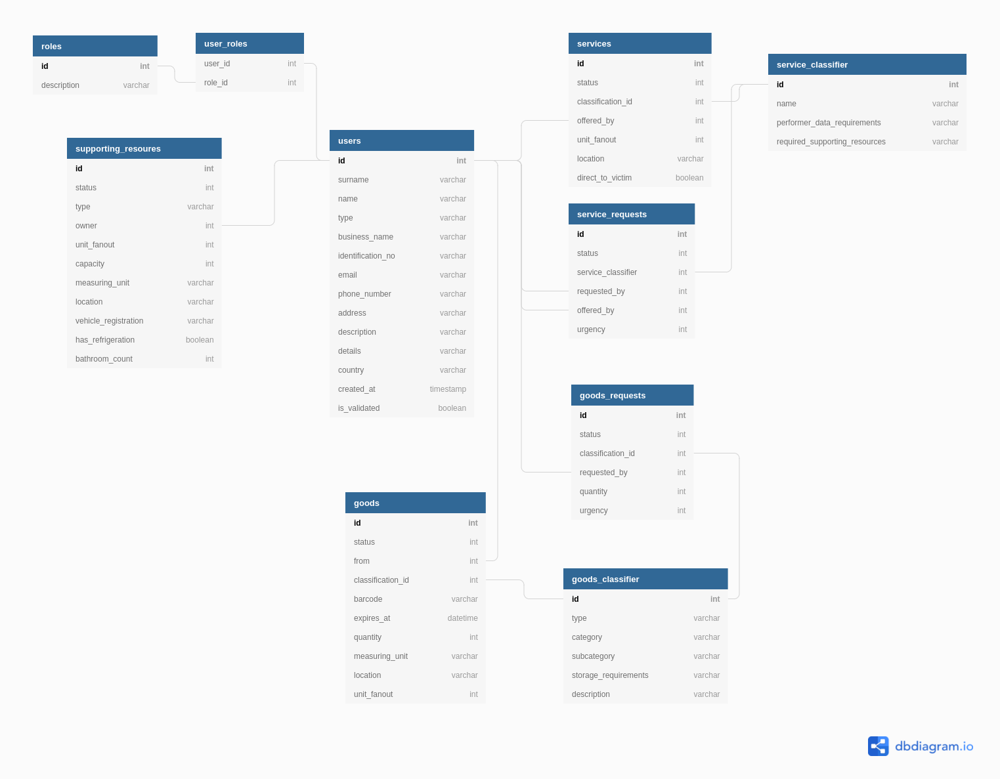

# Drawn using https://dbdiagram.io/
Code for diagram below:
<pre>
Table users {
id int [pk]
surname varchar
name varchar
type varchar //individual, corporate, non-profit, gov.
business_name varchar
identification_no varchar
email varchar
phone_number varchar
address varchar
description varchar
details varchar //JSON
country varchar
created_at timestamp
is_validated boolean
}

//USERS_GROUP = "Users", DSU_GROUP = "DSU", DSU_MANAGER_GROUP = "DSU Manager"
Table roles {
id int [pk]
description varchar
}

Table user_roles as Roles {
user_id int
role_id int
}

Ref: user_roles.user_id  > users.id
Ref: user_roles.role_id > roles.id

Table goods_classifier {
id int [pk]
type varchar //consumable, non-consumable, reusable
category varchar //food, drinks
subcategory varchar //sweets, water
storage_requirements varchar
description varchar
}

Table goods {
id int [pk]
status int //enum
from int //original offerer
classification_id int
barcode varchar
expires_at datetime
quantity int
measuring_unit varchar
location varchar //for now
unit_fanout int //how many people one unit servers, default = 1
}

Ref: goods.from > users.id
Ref: goods.classification_id > goods_classifier.id

Table service_classifier {
id int [pk]
name varchar
performer_data_requirements varchar //comma separated list
required_supporting_resources varchar //comma separated
}

Table services {
id int [pk]
status int //enum
classification_id int
offered_by int
unit_fanout int //how many people one service instance can serve
location varchar //for now
direct_to_victim boolean
}

Ref: services.classification_id > service_classifier.id
Ref: services.offered_by > users.id

Table supporting_resoures {
id int [pk]
status int //enum
type varchar //enum
owner int
unit_fanout int //how many victims this can serve at a time
capacity int //how much it holds
measuring_unit varchar //what it holds
location varchar //for now
vehicle_registration varchar
has_refrigeration boolean
bathroom_count int
}

Ref: supporting_resoures.owner > users.id

Table goods_requests {
id int [pk]
status int //enum
classification_id int
requested_by int
quantity int
urgency int
}

Ref: goods_requests.requested_by > users.id
Ref: goods_requests.classification_id > goods_classifier.id

Table service_requests {
id int [pk]
status int //enum
service_classifier int
requested_by int
offered_by int
urgency int
}

Ref: service_requests.requested_by > users.id
Ref: service_requests.offered_by > users.id
Ref: service_requests.service_classifier > service_classifier.id
</pre>
